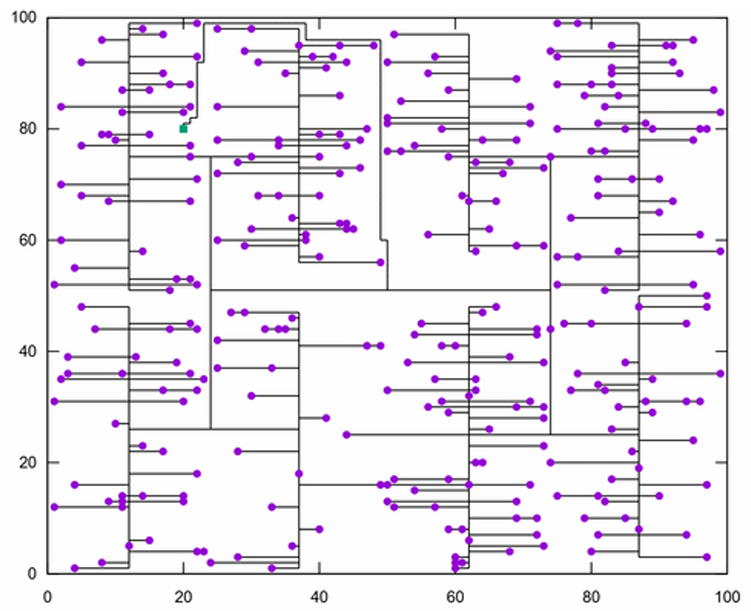

# EDA Projects

Cleaned public versions of three EDA/CAD coursework projects:

- `cts/` - Clock Tree Synthesis
- `legalization/` - Placement Legalization
- `mlrcs/` - Multi-level Resource-Constrained Scheduling

> Coursework, cleaned public version. These are academic-scale implementations for learning and interview discussion, not production EDA tools.

## Public Release Boundary

This repository intentionally does **not** redistribute:

- official course specifications or slides
- benchmark suites, hidden cases, or grading data
- submission archives
- scores, ranks, or private grading feedback
- third-party source/data files whose redistribution terms are unclear

Only self-written source code, attribution notes, and high-level problem descriptions are included. Any result discussion should use sanitized summaries that do not reconstruct unauthorized benchmark content.

## Projects

| Directory | Problem | Implementation Notes |
|---|---|---|
| `cts/` | Build a clock tree connecting sinks while controlling wirelength/skew-related structure. | C++ implementation designed to use FLUTE for rectilinear Steiner tree estimation/routing support. FLUTE source and LUT files are not bundled; see `cts/README.md`. |
| `legalization/` | Move cells from an initial placement into legal row/subrow positions while minimizing displacement. | C++ implementation organized around rows, subrows, components, and placement parsing. |
| `mlrcs/` | Schedule logic operations under resource constraints. | C++ implementation with heuristic scheduling and an ILP path using Gurobi. Gurobi is not bundled; users must provide their own installation/license. |

## Visuals

| Project | Example |
|---|---|
| Clock Tree Synthesis |  |
| Placement Legalization |  |

## Build Notes

Each project keeps its own minimal build instructions in its subdirectory. Toolchains were developed for a Unix-like C++ environment; Windows users may need WSL2 or MSYS2.

## Attribution

Developed as CAD/EDA coursework at National Taiwan University of Science and Technology.

Author: Ning (Cheng-Ning Wang)

## License

This cleaned public version is released under the MIT License. Third-party tools and external dependencies used by the coursework remain under their own licenses and are not redistributed here.
