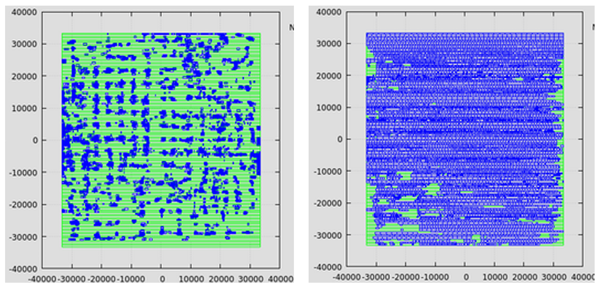

# Placement Legalization

Coursework implementation of standard-cell placement legalization.



Left: before legalization, cells are scattered and overlap. Right: after legalization, cells are aligned to rows and no longer overlap.

## Build

```bash
g++ -std=c++11 CellRow.cpp Component.cpp Placement.cpp Point.cpp SubRow.cpp legalizer.cpp -o legalizer
```

## Usage

```bash
./legalizer INPUT_FILE OUTPUT_FILE
```

The public version excludes benchmark suites, official course specifications, and grading data. It is intended to show the implementation structure and algorithmic approach at coursework scale.
